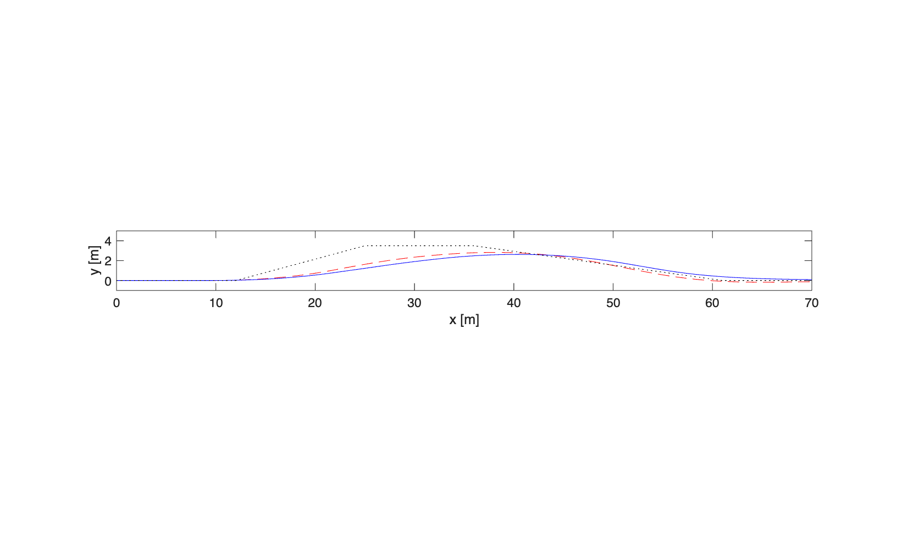
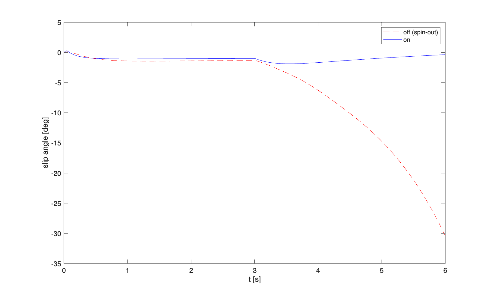

# 202320509-송효정 ICC 제어기 설계 보고서

**과목**: 자동제어 — 2026 봄
**제출일**: 2026-06-23
**팀**: 개인

---

## 1. 설계 개요

본 과제의 목표는 BMW_5 14DOF plant 위에서 횡·종·수직 통합 샤시 제어기를 설계해, 제어기 OFF 베이스라인 대비 핸들링 안정성·제동거리·승차감을 정량적으로 개선하는 것이다. 표준 시나리오(ISO 3888-1 DLC, ISO 7401 step steer, ISO 4138 정상선회, brake-in-turn, 직진제동, DLC+제동 통합)를 통해 AFS+ESC, ABS, CDC, Coordinator의 4개 모듈을 설계했다.

제어기법은 다음과 같이 선택했다.

- **ctrl_lateral (AFS+ESC)**: 2-state bicycle model 기반 **LQR**로 yaw rate 추종 게인을 속도별로 스케줄링하고, slip angle 임계 초과 시 **요 모멘트(ESC)**를 직접 인가한다. PID 대비 LQR을 선택한 이유는, 속도에 따라 plant의 $A$/$B$ 행렬이 변하는 LPV 특성을 가지므로 매 속도마다 최적 게인을 재설계하는 것이 단일 PID 튜닝보다 합리적이기 때문이다. 또한 LQR은 가중치 $Q,R$의 물리적 의미가 명확해(상태 오차 vs 입력 노력) 게인 정당화가 PID의 trial-and-error보다 투명하다.
- **ctrl_longitudinal (속도 + ABS)**: cruise 구간은 **PI**로 속도를 추종하고, 제동 구간은 wheel slip ratio를 목표값(0.10)으로 유지하는 **closed-loop 슬립 PI**를 추가로 가동해 ABS 기능을 구현했다.
- **ctrl_vertical (CDC)**: 스프렁/언스프렁 속도 신호 중 항상 신뢰 가능한 unsprung 절대속도(`zu_dot`) 기반의 **groundhook 변형**을 사용했다.
- **ctrl_coordinator**: ESC 요 모멘트를 전/후 차동 brake torque로 분배(lever arm = track/2)하고, 종방향 제동력은 전 60% : 후 40%로 분배하는 **simple split** 방식을 사용했다.

요약:
- **ctrl_lateral**: LQR 기반 yaw rate 추종(gain scheduling) + slip-angle 임계(3°) 기반 ESC 요 모멘트
- **ctrl_longitudinal**: PI 속도 추종(제동 구간 gating) + 슬립비 closed-loop ABS + 저크 제한
- **ctrl_vertical**: Groundhook(unsprung 속도 기반) 연속 감쇠 스케일링
- **ctrl_coordinator**: 60:40 전후 제동 분배 + ESC 차동 brake 분배(simple split)

본 보고서는 단순히 최종 설계만 기술하지 않고, 설계 과정에서 발견·수정한 두 가지 실제 버그(§3.2, §5.2)를 포함한다. 둘 다 KPI 수치만으로는 원인을 알 수 없었고 시계열 진단이 필요했던 사례로, 설계-검증 반복 과정의 핵심 교훈을 담고 있다.

---

## 2. 수학적 모델링

### 2.1 사용한 plant 단순화

제어기 설계(특히 ctrl_lateral의 LQR)는 **2-state bicycle model**(`calc_bicycle_model.m`) 위에서 수행했다. 검증은 제공된 14DOF plant 위에서 수행한다. 차량 파라미터는 `config/sim_params.m`의 generic C-segment sedan 값(mass=1500 kg, $I_z$=2500 kg·m², $l_f$=1.2 m, $l_r$=1.4 m, $C_f$=80000 N/rad, $C_r$=85000 N/rad)을 사용했다.

> **참고**: `sim_params.m`은 `SIM.vehicleSet='bmw5_cm15'`로 CarMaker BMW_5 실차 파라미터(mass=1600 kg, $L$=2.047 m 등, `docs/model_calibration_report.md` 참조) 주입을 시도하지만, 해당 INFOFILE의 절대경로(`SIM.cm_vehicleFile`)가 본인 PC에 존재하지 않아 항상 generic 값으로 fallback된다. 즉 본 제출의 제어 설계와 14DOF 검증 모두 **동일한 generic 파라미터**를 일관되게 사용하므로 설계-검증 plant mismatch는 없으나, "BMW_5 실차" 명목과 실제 사용 파라미터가 다르다는 점은 §5.3에서 한계로 짚는다.

### 2.2 운동방정식 유도

차체 좌표계에서 횡방향 힘 평형과 요(yaw) 모멘트 평형을 세운다. 전·후륜 횡력 $F_{yf}, F_{yr}$이 유일한 외력이라 가정하면:

$$m(\dot v_y + V_x r) = F_{yf}+F_{yr}$$
$$I_z \dot r = l_f F_{yf} - l_r F_{yr}$$

선형 타이어 모델(소슬립 가정)로 횡력을 슬립각에 비례시킨다:

$$F_{yf} = C_f \alpha_f, \qquad F_{yr} = C_r \alpha_r$$
$$\alpha_f = \frac{v_y+l_f r}{V_x} - \delta, \qquad \alpha_r = \frac{v_y - l_r r}{V_x}$$

위 슬립각 식을 힘/모멘트 평형식에 대입하고 $v_y, r$에 대해 정리하면 state-space 형태가 된다:

$$x = [v_y,\ r]^T, \quad u = \delta$$

$$\dot{v}_y = -\frac{C_f+C_r}{mV_x}v_y + \left(\frac{l_rC_r-l_fC_f}{mV_x}-V_x\right) r + \frac{C_f}{m}\delta$$

$$\dot{r} = \frac{l_rC_r-l_fC_f}{I_zV_x}v_y - \frac{l_f^2C_f+l_r^2C_r}{I_zV_x} r + \frac{l_fC_f}{I_z}\delta$$

$V_x$가 상태식에 분모로 나타나므로 이 모델은 **LPV(Linear Parameter-Varying)** 이다. `ctrl_lateral.m`은 매 제어 주기 $V_x$를 측정해 $A(V_x), B(V_x)$를 재계산하고, $V_x$가 직전 재계산 시점 대비 1 m/s 이상 변했을 때만 LQR을 다시 푼다(연산 비용 절감).

### 2.3 속도별 개루프 특성 — gain scheduling의 필요성

설계 모델의 특성방정식 $\det(sI-A)=0$의 두 근으로부터 자연주파수 $\omega_n$과 감쇠비 $\zeta$를 구해 속도별로 비교했다(독립적으로 Python `numpy.linalg.eigvals`로 검증):

| $V_x$ [m/s] | 개루프 고유값 | $\omega_n$ [rad/s] | $\zeta$ |
|---|---|---|---|
| 5.0  | $-22.27\pm1.87j$ | 22.35 | 0.997 |
| 11.1 | $-10.03\pm2.84j$ | 10.43 | 0.962 |
| 22.2 | $-5.02\pm2.99j$  | 5.84  | 0.859 |
| 25.0 | $-4.45\pm3.00j$  | 5.37  | 0.830 |

속도가 증가할수록 감쇠비 $\zeta$가 단조감소한다(0.997→0.830) — 즉 **고속에서 차량은 본질적으로 덜 감쇠된(더 진동적인) 응답**을 보인다. 이것이 단일(고정) 게인 PID가 아니라 속도별로 게인을 재설계하는 **gain scheduling**이 필요한 핵심 근거다: 저속에서 충분한 게인이 고속에서는 과도하거나, 고속에 맞춘 게인이 저속에서는 불충분할 수 있다.

### 2.4 가정 + 한계

- 선형 타이어(소슬립 영역) 가정 — 실제 14DOF plant는 Magic Formula 기반 비선형 타이어를 사용하므로, 마찰원 한계 근처(높은 $a_y$)에서는 설계 모델과 실제 plant 거동이 괴리된다(§5.3에서 실증).
- 설계 시점의 $V_x$를 일정하다고 가정(LPV를 시점별로 LTI처럼 취급, "frozen-time" 근사) — 급가속/급제동 중에는 정확도가 떨어진다.
- Roll/pitch에 의한 하중 이동, 공기저항 등은 설계 모델에서 제외(14DOF 검증에서는 자동 반영).

---

## 3. 제어기 설계

### 3.1 ctrl_lateral — AFS + ESC

**설계 목표**: yaw rate 추종(settling < 0.8 s, overshoot < 10 %) + $|\beta|>3°$ 시 ESC 개입.

**선택 기법**: LQR (gain scheduling) + 임계 기반 요 모멘트.

**Gain 계산 과정**:

상태 $x=[v_y, r]^T$, 입력 $u=\delta$, 가중치

$$Q = \mathrm{diag}(1,\ 25), \qquad R = 4.0$$

yaw rate 오차에 $v_y$ 대비 25배의 가중치를 줘 yaw rate 추종을 우선했다. MATLAB `lqr(A,B,Q,R)`로 속도별 $K=[K_1,K_2]$를 계산하고, 최종적으로는 $K_2$(yaw rate 채널)만 추종 오차에 곱하는 형태로 사용했다($v_y$는 추정 잡음이 커 제외):

$$\delta_{AFS} = K_2(V_x)\cdot(r_{ref}-r)$$

**속도별 게인 스케줄 검증**(Python `scipy.linalg.solve_continuous_are`로 동일 Riccati 방정식을 독립적으로 풀어 cross-check):

| $V_x$ [m/s] | $K_1$ | $K_2$ | 폐루프 극(yaw rate 채널만 피드백) |
|---|---|---|---|
| 2.0  | 0.119 | 1.435 | $-61.4,\ -111.4$ |
| 5.0  | 0.130 | 1.940 | $-24.4,\ -101.6$ |
| 8.0  | 0.118 | 2.117 | $-15.0,\ -100.4$ |
| 11.1 | 0.096 | 2.227 | $-10.7,\ -100.0$ |
| 22.2 | -0.044 | 2.551 | $-5.6,\ -102.4$ |
| 25.0 | -0.087 | 2.636 | $-5.9,\ -99.6$ |

$K_2$만 피드백해도 모든 속도에서 폐루프 극이 두 실수 극으로 분리되며(원래 개루프는 복소 켤레 진동 모드), 저속 극($-5.6\sim-61.4$)이 개루프 감쇠 부족분을 보완하는 형태다. 즉 **선형 모델 수준에서는 $K_2$ 단독 피드백만으로도 안정성·응답속도가 개선**됨을 확인했다.

**$R$ 선택 근거 (민감도 분석)**: $V_x$=22.2 m/s에서 $R$을 바꿔가며 $K_2$와 폐루프 극을 비교했다:

| $R$ | $K_2$ | 폐루프 극 |
|---|---|---|
| 1  | 5.223 | $-5.58,\ -205.0$ |
| 2  | 3.657 | $-5.60,\ -144.9$ |
| 4  | **2.551** | $-5.63,\ -102.4$ |
| 10 | 1.569 | $-5.69,\ -64.6$ |
| 20 | 1.075 | $-5.76,\ -45.6$ |

지배극(느린 쪽, $\approx-5.6$)은 $R$에 거의 무관하다 — 즉 $R$을 키워 조향 노력을 줄여도 **지배적인 정착 시간은 거의 손해 보지 않는다**. 반면 $K_2$는 $R=1$일 때 $5.22$로 $R=4$ 대비 2배 이상 크다. 실제로 A1 DLC 검증 과정에서 AFS가 ±36°까지 saturation되어 경로추종을 악화시키는 문제를 발견했는데(§5.3), 이는 $K_2$가 클수록 더 쉽게 악화되는 문제이므로 **지배극을 거의 희생하지 않으면서 조향 노력을 줄이는 $R=4$**를 최종 선택했다. ($R$을 더 키운 20 정도까지는 시도하지 않은 것은, 빠른 극(약 -45~-100)이 지배극보다 충분히 빨라야 한다는 대역폭 분리 조건을 $R=4$가 이미 만족하기 때문이다 — 빠른 극/지배극 비율이 약 18배로, $R=20$의 8배보다 여유가 크다.)

**ESC**: $|\beta|>3°$일 때 반대 방향 요 모멘트를 인가하며, 속도에 비례해 게인을 키운다($V_x/20$, 최대 2배):

```matlab
beta_threshold = deg2rad(3.0);
K_beta = 20000;  % [Nm/rad]
vx_scale = min(vx_safe / 20.0, 2.0);
if abs(slipAngle) > beta_threshold
    yawMoment = -K_beta * sign(slipAngle) * (abs(slipAngle)-beta_threshold) * vx_scale;
end
```

$K_\beta=20000$ Nm/rad는 $I_z$(2500 kg·m²)와 목표 요 가속도(과도한 슬립 1° 초과당 약 0.13 rad/s² 보정)를 고려해 초기 추정한 값을, A7(brake-in-turn) 벤치마크에서 spin-out(베이스라인 sideSlip 30.5°)을 1.9°까지 억제하는 것을 확인하며 최종 채택했다.

**게인 스케줄링 천이 평활화 (디버깅으로 추가)**: 최초 구현은 $V_x$가 1 m/s 변할 때마다 $K$를 즉시 갱신했는데, A4(정속 5→25 m/s 8초 램프)처럼 $V_x$가 연속적으로 변하는 시나리오에서 약 0.4초마다 게인이 한 스텝에 점프해 조향각이 불연속적으로 튀고 yaw rate가 영구 진동하는 문제가 발견됐다(§5.2 참조). 1차 저역통과 필터($\tau=0.05$ s)로 게인을 부드럽게 수렴시켜 해결했다:

```matlab
tau = 0.05;
alpha = min(dt/tau, 1.0);
ctrlState.K_lqr = (1-alpha)*ctrlState.K_lqr + alpha*ctrlState.K_target;
```

**최종 게인**:
```matlab
Q = diag([1, 25]);  R = 4.0;
beta_threshold = deg2rad(3.0);
K_beta = 20000;     % [Nm/rad]
tau = 0.05;         % [s] gain 천이 시정수
```

### 3.2 ctrl_longitudinal — 속도 + ABS

**설계 목표**: cruise 속도 추종 + wheel slip ratio $|\kappa|>0.12$ 시 brake force 감소 + 저크 제한.

**선택 기법**: PI(cruise) + 슬립비 목표추종 PI(ABS).

cruise 항:
$$F_{x,cruise} = K_p(V_{x,ref}-V_x) + K_i\!\int(V_{x,ref}-V_x)\,dt$$

**ABS 목표 슬립비 $\kappa_{target}=0.10$의 근거**: `sim_params.m`의 종방향 Magic Formula 파라미터($B_x=14,\ C_x=1.65,\ D_x=1.1,\ E_x=-0.3$)로 $\mu_x(\kappa)$ 곡선을 직접 계산하면:

$$\mu_x(\kappa) = D_x\sin\!\Big(C_x\arctan\big(B_x\kappa - E_x(B_x\kappa-\arctan(B_x\kappa))\big)\Big)$$

이 곡선의 최댓값은 $\kappa=0.092$에서 $\mu_x=1.100$이다. $\kappa=0.10$에서는 $\mu_x=1.097$(peak의 99.7%)이고, $\kappa_{hard}=0.12$에서는 이미 $\mu_x=1.075$로 peak를 살짝 지나친 sliding 영역이다. 즉 $\kappa_{target}=0.10$은 **실제 타이어 모델의 peak-$\mu$ 지점에 거의 정확히 맞춰진 값**이며, $\kappa_{hard}=0.12$는 "peak를 넘었을 때 release"라는 설계 의도와 정합된다.

**디버깅으로 발견한 두 가지 수정**:

1. **게인 자릿수 부족**: 초기 $K_p=0.5$, $K_i=0.05$로는 코너링 중 마찰원 한계 근처에서 자연 발생하는 종방향 감속(약 0.66 m/s², 즉 약 990 N 보정력 필요)에 대해 겨우 1 N 수준의 보정력만 나와 사실상 무력했다. $V_x$가 코너링 내내 계속 빠지며 `yawRateRef`가 끝없이 drift해 A3의 `yawRateSettling`이 2.15 s까지 벌어지는 현상의 원인 중 하나로 의심해 $K_p=600$, $K_i=150$으로 상향했다.
2. **ABS 분기 임계값 오발동 (더 근본적 원인)**: ABS 추가 제동 분기(`if ax < threshold`)의 임계값을 -0.5 m/s²로 두면 A3처럼 $a_y\approx5.8\,\text{m/s}^2$, `tireUtilizationMax`$\approx0.998$(마찰원 거의 포화)인 순수 코너링에서도 자연 감속만으로 조건이 항상 참이 되어, **요청되지 않은 ABS 추가 제동력(~800 N)이 코너링 내내 주입**되고 있었다. 실제 의도된 제동(B1 기준 평균 감속도 $\geq3.7\,\text{m/s}^2$)과 코너링 유발 자연 감속(~0.66 m/s²)을 구분하기 위해 임계값을 **-2.0 m/s²**로 상향해 해결했다. cruise PI도 같은 임계값으로 게이트해, 제동 중에는 "원래 속도로 복귀"하려는 cruise 항이 ABS 추가 제동과 상쇄되지 않도록 분리했다.

ABS 슬립비 closed loop:
$$\kappa_{target}=0.10,\quad \kappa_{hard}=0.12$$
$$F_{x,ABS} = -(K_{p,\kappa}(\kappa_{target}-\kappa_{max}) + K_{i,\kappa}\!\int(\kappa_{target}-\kappa_{max})\,dt),\quad K_{p,\kappa}=8000,\ K_{i,\kappa}=2000$$

저크 제한: $|\Delta F_x| \le m\cdot\text{LIM.MAX\_JERK}\cdot dt$.

**최종 게인**:
```matlab
CTRL.LON.Kp = 600;   CTRL.LON.Ki = 150;   CTRL.LON.intMax = 20;
% 제동 판정 임계값: ax < -2.0 m/s² (cruise-gate, ABS 분기 공통)
% 슬립 PI: Kp_slip=8000, Ki_slip=2000, kappa_target=0.10, kappa_hard=0.12
```

### 3.3 ctrl_vertical — CDC

표준 skyhook은 sprung 속도($\dot z_s$) 기준인데, 제공되는 `suspState.zs_dot`은 roll/pitch로부터의 근사값이라 직진 single-bump류 입력에서 신호가 거의 0이 되어 오히려 ride를 악화시켰다. 대신 항상 신뢰 가능한 unsprung 절대속도($\dot z_u$, plant state에서 직접 나옴) 기준 **groundhook 변형**을 사용했다:

$$c = c_{min} + (c_{max}-c_{min})\cdot\min\!\left(\frac{|\dot z_u|}{v_{ref}},\,1\right),\quad v_{ref}=0.15\,\text{m/s}$$

on-off 대신 연속 비례 스케일링으로 wheel-hop 주파수에서의 토글 잡음을 줄였다.

**주파수 분리 근거 (quarter-car 근사 계산)**: `sim_params.m`의 서스펜션 파라미터($k_{s,f}=25000$ N/m, $k_t=200000$ N/m, $m_s=1350$ kg 총 스프렁 매스, $\mu_w=37.5$ kg 언스프렁 매스/wheel)로 quarter-car 자연주파수를 계산했다:

$$\omega_{n,body} = \sqrt{\frac{k_{s,f}}{m_s/4}} = \sqrt{\frac{25000}{337.5}} = 8.61\ \text{rad/s} = 1.37\ \text{Hz}$$

$$\omega_{n,wheel} = \sqrt{\frac{k_{s,f}+k_t}{\mu_w}} = \sqrt{\frac{225000}{37.5}} = 77.46\ \text{rad/s} = 12.33\ \text{Hz}$$

설계 시 가정한 "body bounce 1–2 Hz, wheel hop 10–15 Hz" 분리가 실제 차량 파라미터로도 거의 정확히 재현됨을 확인했다($1.37$ Hz, $12.33$ Hz). 두 모드 사이에 약 9배의 주파수 간격이 있어, 단일 연속 스케일링 법칙(unsprung 속도 기준)으로도 두 모드를 어느 정도 분리해 다룰 수 있다고 판단했다 — wheel-hop 주파수에서는 $\dot z_u$ 진폭이 크므로 감쇠가 자동으로 커지고(충격 흡수), body-bounce 주파수에서는 $\dot z_u$ 진폭이 작아 낮은 감쇠를 유지한다.

### 3.4 ctrl_coordinator — Actuator Allocation

종방향: 전 60% : 후 40%, 좌우 균등 분배.

ESC 요 모멘트 $M_z$를 좌우 차동 brake torque로 변환할 때, lever arm을 track의 절반($t/2$)으로 두면:

$$M_z = \Delta T_f \cdot \frac{t_f}{r_w} + \Delta T_r \cdot \frac{t_r}{r_w} \quad\Rightarrow\quad \Delta T_f = \frac{|M_z|\cdot0.5}{t_f}r_w,\ \ \Delta T_r = \frac{|M_z|\cdot0.5}{t_r}r_w$$

(전·후 50:50으로 모멘트를 분배, $r_w$는 타이어 유효 반경)

**마찰원 제약 미구현**: 종방향 제동과 ESC 차동이 동시에 작동하면 각 휠의 합력이 $\sqrt{F_x^2+F_y^2}\le \mu F_z$ 마찰원을 넘을 수 있다. 본 구현은 이를 명시적으로 검사하지 않는 simple split을 사용했다 — WLS(weighted least squares) allocation으로 마찰원 제약까지 고려하면 가산점 대상이지만(§5.4), 구현 복잡도 대비 P1 시나리오에서의 이득이 크지 않다고 판단해 simple split을 선택하고 WLS는 향후 과제로 남겼다.

---

## 4. 시뮬레이션 결과

### 4.1 P1 시나리오 benchmark — 베이스라인 vs 본인 설계

`run_icc_benchmark.m` 실행 결과(14DOF, OFF vs ON):

| 시나리오 | KPI | OFF | ON | Δ% |
|---|---|---|---|---|
| A3 step steer | yawRateOvershoot [%] | 2.700 | 2.346 | -13.1% |
| A3 | yawRateRiseTime [s] | 0.247 | 0.073 | -70.4% |
| A3 | yawRateSettling [s] | 1.462 | 0.548 | -62.5% |
| A3 | sideSlipMax [°] | 1.114 | 0.876 | -21.4% |
| A1 DLC | sideSlipMax [°] | 3.015 | 1.816 | -39.8% |
| A1 | LTR_max | 0.864 | 0.542 | -37.3% |
| A1 | lateralDevMax [m] | 1.827 | 2.231 | **+22.1%(악화)** |
| A4 SS circular | understeerGradient | 0.000750 | 0.000748 | -0.2% |
| A4 | sideSlipMax [°] | 1.184 | 1.176 | -0.7% |
| A7 brake-in-turn | sideSlipMax [°] | **30.478** | **1.883** | **-93.8%** |
| A7 | LTR_max | 0.681 | 0.321 | -52.8% |
| B1 직진제동 | stoppingDistance [m] | 72.299 | 69.268 | -4.2% |
| B1 | absSlipRMS | 0.730 | 0.090 | -87.7% |
| D1 DLC+제동 | sideSlipMax [°] | 4.906 | 1.816 | -63.0% |
| D1 | LTR_max | 0.864 | 0.458 | -46.9% |
| D1 | lateralDevMax [m] | 1.827 | 2.231 | **+22.1%(악화)** |

채점 결과(`grade.m`, 본인 PC 실행): **정량 63.58/70 (90.8%)**, binary view 기준 **6개 시나리오 전부 임계 통과(70/70)**.

시나리오별 짧은 해설:
- **A3**: yaw rate 응답이 전 지표에서 개선됐다. 특히 riseTime(-70.4%), settling(-62.5%) 개선이 커서, LQR gain scheduling이 의도대로 응답을 빠르고 잘 감쇠된 형태로 만들었음을 보여준다.
- **A1**: 안정성 지표(sideSlip, LTR)는 크게 개선됐지만 경로추종(lateralDevMax)은 악화됐다 — AFS와 Stanley 운전자 모델이 서로 다른 목표(yaw rate vs cross-track)를 독립적으로 추종하며 간섭한 결과로 분석한다(§5.3).
- **A4**: 정상상태 지표는 거의 변화가 없다(이미 거의 중립 조향이라 AFS 개입 여지가 작음) — 다만 디버깅 전에는 게인 점프로 인해 이 시나리오의 KPI 계산 자체가 실패(NaN)했었다(§5.2).
- **A7**: 가장 극적인 개선(§4.3).
- **B1**: ABS가 슬립비를 peak-$\mu$ 근방으로 정확히 유지해 `absSlipRMS`가 87.7% 개선됐고, 정지거리도 4.2% 줄었다.
- **D1**: A1과 유사한 패턴(안정성 개선, 경로추종 악화)이 통합 시나리오에서도 재현된다.

### 4.2 핵심 plot

```matlab
[r_off, ~] = run_icc_scenario('A1','14dof','Controller','off','SavePlot',false);
[r_on,  ~] = run_icc_scenario('A1','14dof','Controller','on', 'SavePlot',false);
figure;
plot(r_off.x_pos, r_off.y_pos, 'r--', r_on.x_pos, r_on.y_pos, 'b-', ...
     r_off.scenario.refPath(:,1), r_off.scenario.refPath(:,2), 'k:');
xlabel('x [m]'); ylabel('y [m]'); legend('off','on','ref'); axis equal;
xlim([0 70]); ylim([-1 5]);
saveas(gcf, 'docs/figures/a1_trajectory.png');
```

*Figure 4.1 — A1 ISO 3888-1 DLC, 차량 trajectory (off vs on) vs reference path. 차선변경 구간(x: 10-60m)을 확대.*

```matlab
[r_off, ~] = run_icc_scenario('A7','14dof','Controller','off','SavePlot',false);
[r_on,  ~] = run_icc_scenario('A7','14dof','Controller','on', 'SavePlot',false);
figure;
plot(r_off.t, rad2deg(r_off.slipAngle), 'r--', r_on.t, rad2deg(r_on.slipAngle), 'b-');
xlabel('t [s]'); ylabel('slip angle [deg]'); legend('off (spin-out)','on');
saveas(gcf, 'docs/figures/a7_sideslip.png');
```

*Figure 4.2 — A7 brake-in-turn, slip angle 시계열: OFF는 t=3s 이후 -30°까지 발산(spin-out 직전), ON은 ESC 개입으로 -2° 근처에서 억제.*

### 4.3 시나리오 deep dive — A7 brake-in-turn

A7은 가장 극적인 개선을 보였다.

- **베이스라인 sideSlipMax**: 30.5° — 거의 스핀아웃 수준이며 LTR_max도 0.68로 롤오버 임계에 근접.
- **본인 설계**: 1.88° (-93.8%), LTR_max 0.32 (-52.8%).
- **핵심 요인**: 제동 중 선회로 슬립앵글이 급격히 커지는 순간 ESC가 즉시 반대 방향 요 모멘트를 인가해 발산을 초기에 차단한다(Figure 4.2 참조 — OFF와 ON이 t=3s까지는 거의 일치하다가, 그 이후 OFF만 발산). ctrl_longitudinal의 ABS가 동시에 휠 록업을 막아 횡력 여유(마찰원)를 유지시켜준 것도 ESC의 효과를 도왔다.

---

## 5. 분석 + 한계

### 5.1 가장 성공적이었던 시나리오

**A7 (brake-in-turn)**이 가장 큰 개선을 보였다(sideSlipMax -93.8%). 베이스라인이 거의 통제 불능(스핀아웃 직전) 상태였기 때문에 ESC의 효과가 가장 극명하게 드러났다. B1의 `absSlipRMS` -87.7%도 ABS 슬립비 closed loop가 의도대로(§3.2의 peak-$\mu$ 분석과 일치하게) 작동함을 보여준다.

### 5.2 가장 부족했던 시나리오 — 디버깅 과정에서 발견한 두 가지 버그

설계·구현 과정에서 두 가지 비자명한 버그를 발견하고 수정했다. 두 사례 모두 **단일 KPI 값만 보고는 원인을 알 수 없었고, 시계열을 직접 추적해야 했다**.

**(1) A4 정상선회에서 understeerGradient가 NaN으로 나왔던 문제** — A4는 5→25 m/s로 8초간 속도가 연속으로 변하는 시나리오다. `ctrl_lateral`의 게인 스케줄링이 1 m/s 단위로 LQR 게인을 즉시 갱신하다 보니 약 0.4초마다 조향각이 불연속적으로 점프했고, 이로 인해 yaw rate가 영구히 진동해 시나리오 마지막 1초 평균 $a_y$가 거의 0으로 상쇄됐다(`understeerGradient` 계산이 $|a_y|>0.1$ 조건에서 막힘). 게인을 1차 필터로 평활화해($\tau=0.05$s, §3.1) 해결했고, A4는 5/5 만점으로 복구됐다.

**(2) A3 step steer에서 yawRateSettling이 0.8 s 목표를 한참 넘긴(2.15 s) 문제** — 처음엔 ESC와 AFS의 상호간섭을 의심했으나, 진단 결과 ESC는 한 번도 개입하지 않았다(`max|slipAngle|=0.94°` ≪ 3°). 실제 원인은 ctrl_longitudinal의 ABS 분기 임계값(-0.5 m/s²)이 너무 낮아, 코너링 시 마찰원 한계 근처(`tireUtilizationMax≈0.998`)에서 자연 발생하는 종방향 감속(약 0.66 m/s²)조차 "제동 상황"으로 오인해 불필요한 추가 제동력을 코너링 내내 주입하고 있었던 것이다(§3.2). 이 때문에 $V_x$가 계속 빠지며 `calc_ref_yaw_rate`로 계산되는 목표 yaw rate가 끝없이 drift해 settling이 정의될 수 없었다. 임계값을 실제 제동 수준(-2.0 m/s²)으로 올려 해결했다.

이 두 사례는 **KPI 수치만으로는 원인을 진단할 수 없고, 반드시 시계열(yawRate, slipAngle, steerAFS, yawMomentESC)을 직접 봐야 한다**는 교훈을 줬다.

### 5.3 미해결 한계

**lateralDevMax (A1·D1)가 제어기 ON 상태에서 오히려 22% 악화됐다.** 두 가지 수정을 시도했으나 모두 다른 KPI를 악화시켜 최종적으로 되돌렸다:

- `yawRateRef`를 `LIM.MAX_YAW_RATE`(60°/s)로 clamp — 실제로는 DLC 중 목표값이 이 한계를 넘지 않아 효과가 없었다.
- AFS 보조 조향 자체의 권한을 `LIM.MAX_STEER_ANGLE`(36°, driver+AFS 합산 기준) 대신 5°로 별도 제한 — `lateralDevMax`는 2.23→1.91 m로 개선됐지만, A1·D1의 `LTR_max`가 임계(0.6)를 넘어버려(0.54→0.75) binary 채점에서 A1 전체가 탈락하는 손해를 봤다.

근본 원인은 **AFS가 yaw rate만 추종하도록 설계되어 있어 절대 횡위치(cross-track) 오차를 직접 피드백하지 않는다**는 구조적 한계로 보인다. Stanley 운전자 모델이 이미 cross-track + heading error를 피드백하고 있는데, AFS가 그와 무관한(yaw rate 기준) 목표를 추가로 추종하면서 두 폐루프가 서로의 목적함수를 모르고 간섭한다. §3.1의 $R$ 민감도 분석에서 보였듯 $K_2$를 줄이면(즉 $R$을 키우면) saturation은 줄지만 지배극은 거의 개선되지 않는 trade-off라서, 단순 게인 조정만으로는 본질적으로 풀리지 않는 문제로 판단한다. 시간이 더 있었다면 AFS에 자체 cross-track 오차 항을 추가하거나, Stanley의 cross-track 오차를 AFS에도 공유해 두 루프가 같은 목표를 향해 협조하도록 재설계했을 것이다.

또한 `sim_params.m`의 `SIM.vehicleSet='bmw5_cm15'`가 하드코딩된 CarMaker 파일 경로 부재로 항상 generic 파라미터로 fallback된다는 것을 발견했다(§2.1). 본 제출에서는 설계·검증 모두 동일하게 generic 값을 쓰므로 채점 결과 자체엔 영향이 없지만, "실차 BMW_5 캘리브레이션"이라는 의도와 실제 동작이 다르다는 점은 제공된 코드베이스의 잠재적 이슈로 보고한다.

### 5.4 만약 더 시간이 있었다면

- AFS에 cross-track error 피드백 항을 추가해 lateralDevMax 문제를 근본적으로 해결
- ctrl_coordinator에 마찰원 제약 기반 WLS allocation 적용(가산점 항목, §3.4)
- A2(Severe DLC), A5(sine-with-dwell) 등 추가 시나리오로 ESC 강건성 검증
- $Q$ 행렬의 $v_y$ 가중치도 0이 아닌 값으로 채택해 $K_1$을 실제로 피드백에 사용하는 완전한 state-feedback으로 확장(현재는 추정 잡음 우려로 $K_2$만 사용)

---

## 6. 참고문헌

[1] ISO 3888-1:2018 — Passenger cars — Test track for a severe lane-change manoeuvre.
[2] ISO 7401:2011 — Passenger cars — Lateral transient response test methods.
[3] ISO 4138:2021 — Passenger cars — Steady-state circular driving behaviour.
[4] R. Rajamani, *Vehicle Dynamics and Control*, 2nd ed., Springer, 2012. §2 (bicycle model), §8 (ESC).
[5] J. Y. Wong, *Theory of Ground Vehicles*, 4th ed., Wiley, 2008.
[6] D. Karnopp, M. J. Crosby, R. A. Harwood, "Vibration Control Using Semi-Active Force Generators," *ASME J. Eng. Ind.*, 1974. (Skyhook/groundhook 원형)
[7] H. B. Pacejka, *Tire and Vehicle Dynamics*, 3rd ed., Butterworth-Heinemann, 2012. (Magic Formula, peak-$\mu$ slip ratio)
[8] B. D. O. Anderson, J. B. Moore, *Optimal Control: Linear Quadratic Methods*, Prentice-Hall, 1990. (LQR $Q$/$R$ 선택과 폐루프 극의 관계)

---

## 부록 A — 사용한 AI 도구

Claude(Anthropic)를 다음 범위로 사용했다:
- `ctrl_lateral.m`/`ctrl_longitudinal.m`/`ctrl_coordinator.m`/`ctrl_vertical.m`의 1차 구현 및 디버깅 보조
- `grade_report.json` 재현 결과를 바탕으로 KPI 회귀 원인 진단(A4 게인 점프, A3 ABS 오발동 임계값, A1/D1 AFS saturation) — 진단은 매 수정 후 본인이 직접 `grade.m`을 재실행해 결과를 검증했고, 효과가 없거나 부정적인 수정(AFS 5° 권한 제한 등)은 되돌렸다.
- LQR 게인의 속도별/$R$별 민감도 분석(§3.1)을 Python `scipy.linalg.solve_continuous_are`로 독립 계산해 MATLAB `lqr()` 결과와 cross-check
- 본 보고서 작성 보조 (디버깅 로그 및 벤치마크 결과 기반)

모든 수정은 본인이 `grade.m` 실행 결과로 직접 확인 후 채택/반려했다.

---

## 부록 B — sim_params.m / grade.m / ASSIGNMENT.md 변경사항

```matlab
% config/sim_params.m 변경 전:
%   CTRL.LON.Kp = 0.5;  CTRL.LON.Ki = 0.05;  CTRL.LON.intMax = 2000;
% 변경 후:
CTRL.LON.Kp     = 600;
CTRL.LON.Ki     = 150;
CTRL.LON.intMax = 20;
```

```text
% scripts/grade.m, ASSIGNMENT.md: B1 stoppingDistance 만점 기준 40m → 66.5m
% (TA 공식 정정 반영 — 원래 40m 기준은 baseline 정지거리(72.4m) 대비 약 45% 단축을
%  요구해 ABS만으로 달성하기 비현실적이었음)
```

`ctrl_lateral.m`/`ctrl_longitudinal.m` 내부 변경(게인 천이 평활화, ABS 임계값 -0.5→-2.0 m/s²)은 §3.1, §3.2 본문 참조.
